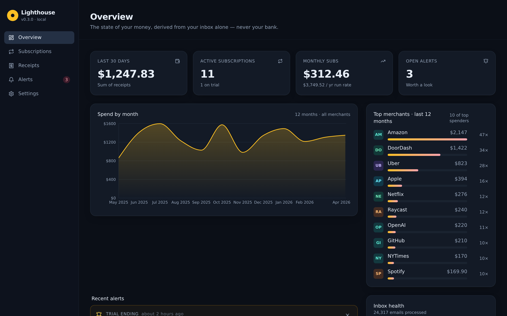
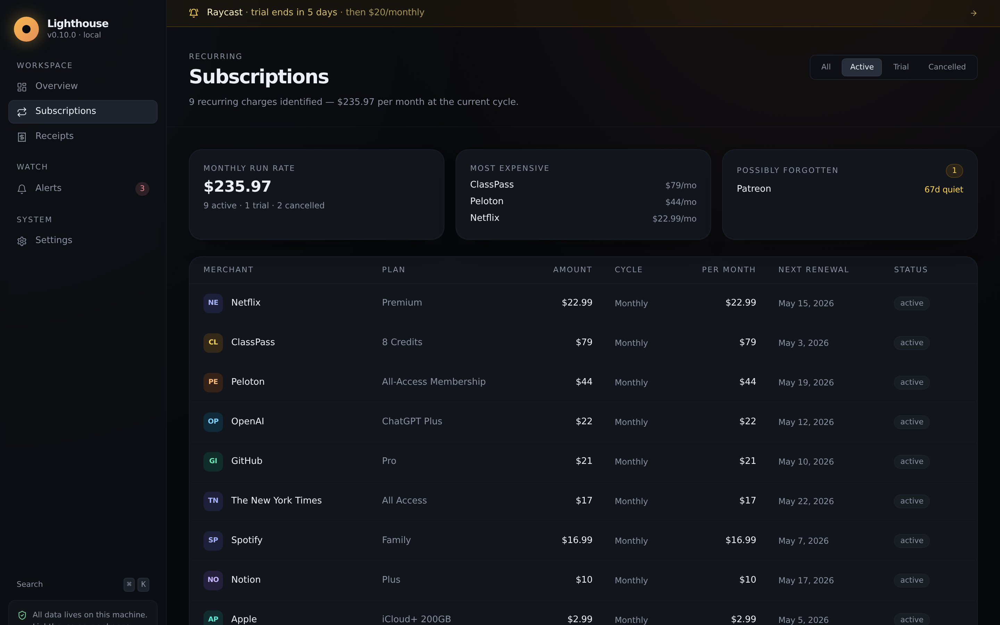
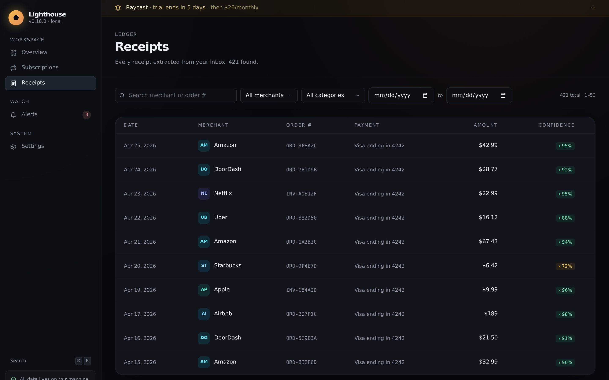
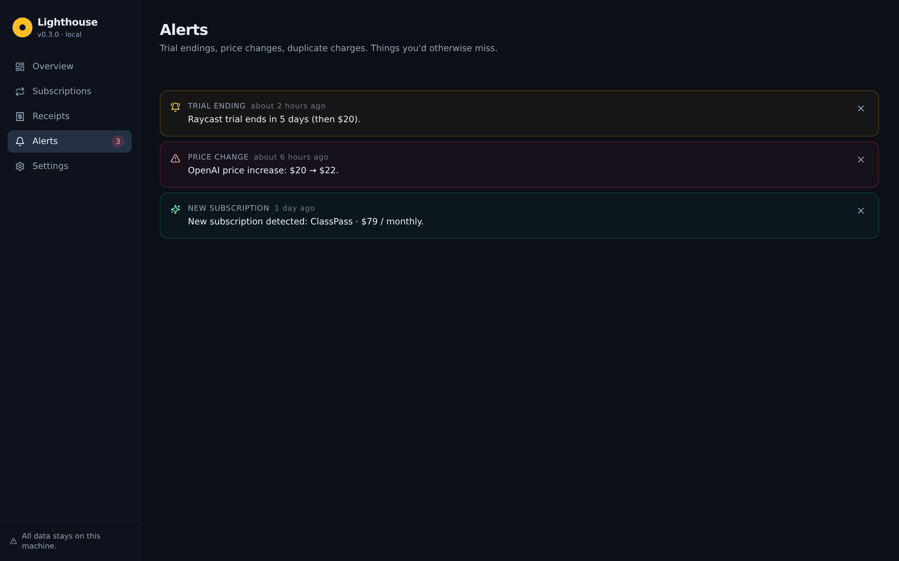
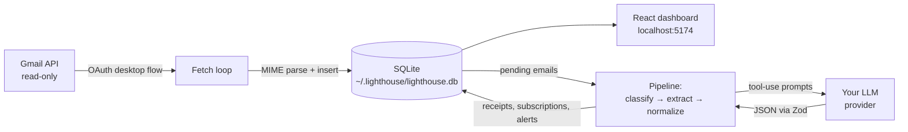

<div align="center">
  
</div>

<p align="center">
  <a href="https://github.com/vnmoorthy/Lighthouse/actions/workflows/ci.yml"></a>
  <a href="./LICENSE"></a>
  <a href="./CHANGELOG.md"></a>
  <a href="https://github.com/vnmoorthy/Lighthouse/stargazers"></a>
  <a href="https://github.com/vnmoorthy/Lighthouse/issues?q=is%3Aopen+label%3A%22good+first+issue%22"></a>
</p>

<p align="center">
  <b>Turn your Gmail inbox into a clean ledger of every purchase and active subscription.</b><br>
  Local-only. AI-extracted. MIT-licensed. ~6,600 lines of TypeScript.
</p>

<p align="center">
  <a href="#quickstart"><b>Quickstart →</b></a> &nbsp;·&nbsp;
  <a href="#what-it-does"><b>What it does</b></a> &nbsp;·&nbsp;
  <a href="#why"><b>Why</b></a> &nbsp;·&nbsp;
  <a href="./docs/ARCHITECTURE.md"><b>Architecture</b></a> &nbsp;·&nbsp;
  <a href="./CONTRIBUTING.md"><b>Contribute a merchant rule</b></a>
</p>

---

## What it does

<div align="center">
  
</div>

Three things that are surprisingly hard to assemble today:

1. **A clean ledger** of every purchase across every merchant for the last 24 months.
2. **Every active subscription** with its renewal date, amount, and a one-click *"show me the email that proves this is recurring"* view.
3. **Free-trial-ending alerts** and **price-increase alerts** on existing subscriptions.

### Subscriptions you actually still pay for

<div align="center">
  
</div>

Every recurring charge in your inbox, deduped across the 24 monthly Netflix receipts you've gotten, with status (`active` / `trial` / `cancelled`), per-month cost (so a $120 annual sub appears as $10/mo), next renewal date, and a one-click drawer that shows the source email so you can verify it for yourself.

### Receipts, fully searchable

<div align="center">
  
</div>

Filter by merchant, date range, free-text search across order numbers and merchant names. Each row opens a modal with the line items the LLM extracted, the original email, and an extraction confidence score (so you can spot-check the model's work).

### Alerts you'd otherwise miss

<div align="center">
  
</div>

Lighthouse runs four alert checks at the end of every sync:

- **Trial ending** in the next 7 days — so the free PDF tool doesn't quietly become $9.99/mo.
- **Price change** — when the latest charge differs from the prior 3 by more than 5%.
- **New subscription** — anything that wasn't in your last sync.
- **Duplicate charge** — two receipts from the same merchant within 24h, within 5%.

Each alert is suppressed for 30 days after creation so you don't drown in noise.

## Why

Most "subscription trackers" want one of two things:

1. **Your bank credentials**, via Plaid/MX/etc. They get a complete view of your finances; you get convenience. The privacy tradeoff is enormous — and fundamentally, the merchant-name data on a bank statement is *worse* than what's already in your inbox.
2. **OAuth into your Gmail and a copy of your data on their servers.** Same tradeoff with extra steps.

Lighthouse takes a third path: read-only Gmail access, an LLM extractor, a local SQLite database, and a dashboard you open at `localhost:5174`. **Your data never leaves your computer.** The LLM only sees the email contents you ship it — and you can swap to a local Ollama model and unplug the network entirely.

## Quickstart

```bash
git clone https://github.com/vnmoorthy/Lighthouse.git
cd Lighthouse
npm install

# Try the dashboard immediately, with fake data:
npm run seed:demo
npm run serve
# → open http://localhost:5174
```

To run on your real inbox:

```bash
# 1. Create OAuth credentials at https://console.cloud.google.com/apis/credentials
#    (application type: Desktop app). Then:
cp .env.example .env
# Fill in GOOGLE_CLIENT_ID, GOOGLE_CLIENT_SECRET, ANTHROPIC_API_KEY.

# 2. Pick a passphrase, do the OAuth dance.
npm run setup

# 3. Crawl the last 24 months of mail and run the LLM extractor.
npm run sync

# 4. See the dashboard.
npm run serve   # then open http://localhost:5174
```

## How extraction works



Four LLM stages, each independently caching:

1. **Classify (Stage 1).** Cheap, single-shot LLM prompt sees only `(from, subject, snippet, first 500 chars)` and assigns one of nine buckets. Result is hashed and cached, so re-syncing is free.
2. **Extract (Stage 2 / 3).** Receipts and renewals get the receipt extractor; signup/trial/cancel/price emails get the subscription extractor. Both use tool-use / JSON-mode to coerce structured output, then validate against a Zod schema before writing.
3. **Normalize (Stage 4).** "AMZN Mktp US*1A2B3", "Amazon.com", and "Amazon Marketplace" all collapse into one `Amazon` row. The first 70+ merchants are hand-coded rules ([open a PR to add yours](./CONTRIBUTING.md)). Anything else is normalized by the LLM and cached forever.
4. **Dedupe and score.** Charges group into subscriptions; status (`active` / `cancelled` / `trial`) is computed from cycle math.

## Cost

Approximate, on a typical inbox at default settings (no batching). The classifier dominates because every email goes through it; extraction only runs on the ~30% of emails the classifier flagged as relevant.

| Inbox size | Approx classify | Approx extract | Total cost | Approx wall-time |
| --- | ---: | ---: | ---: | ---: |
| 5,000 emails (1 yr light) | ~$4 | ~$6 | **~$10** | ~20 min |
| 25,000 emails (2 yr typical) | ~$20 | ~$30 | **~$50** | ~90 min |
| 50,000 emails (2 yr heavy) | ~$40 | ~$60 | **~$100** | ~3 hr |

Re-syncing is essentially free — classifier results are cached on `sha256(from + subject + snippet)` so only genuinely new emails hit the API. Switch to `LLM_PROVIDER=ollama` to drop API cost to zero in exchange for slower extraction.

> Roadmap item: classifier batching (20 emails per call) is expected to cut cost by ~5x. See [#issues with the `enhancement` label](https://github.com/vnmoorthy/Lighthouse/labels/enhancement).

## Privacy and safety

- **Read-only Gmail scope.** Lighthouse only requests `gmail.readonly`. It cannot send, modify, or delete mail.
- **Local-only by default.** The API binds to `127.0.0.1`. The frontend is served from the same origin. No CORS, no exposure beyond your machine.
- **Encrypted token at rest.** Your Gmail refresh token is encrypted with a key derived from your passphrase via argon2id (`m=64MiB, t=3, p=1`) and stored in the SQLite kv table. Without the passphrase, the encrypted blob is useless.
- **Bearer token between SPA and API.** Generated on first setup, stored in `kv`. The SPA fetches it via a same-host-only `/api/__token__` endpoint so other processes on the machine can't snoop.
- **Sandboxed email-HTML rendering.** When you click "Show HTML" in the email viewer, the body is rendered in `<iframe sandbox="">` — scripts, forms, and navigation are all blocked. Tracking pixels still load though, so the default view is plaintext.
- **No telemetry.** Lighthouse calls Gmail and your LLM, and nothing else. Outbound traffic is auditable from `~/.lighthouse/lighthouse.log`.

## FAQ

**Is this safe?** It's as safe as the LLM provider you point at it. If you don't trust them, set `LLM_PROVIDER=ollama` and run a local model. Lighthouse never sends data anywhere except (a) the Gmail API, to read your mail, and (b) your chosen LLM.

**What happens to my data?** It lives in `~/.lighthouse/lighthouse.db`. Delete the file and it's gone — no servers, no backups, no "we still have a copy."

**Can I run the LLM locally?** Yes. Set `LLM_PROVIDER=ollama` and pick a model that supports JSON mode (Llama 3.1 8B works fine; Qwen 2.5 14B is better). Quality drops a bit on the harder categories (price changes, trial endings) but day-to-day extraction is solid, and you stop paying per email.

**My receipts didn't extract.** Look in `~/.lighthouse/lighthouse.log` for the row id. Re-run with `LIGHTHOUSE_DEBUG=1` to see the model output. If you find a recurring failure mode, please [open an issue](https://github.com/vnmoorthy/Lighthouse/issues/new/choose) with a redacted sample — we improve the prompts, not by adding regex band-aids.

**Will this work for non-USD inboxes?** Yes. Currencies are stored as ISO 4217 codes alongside cents-equivalents. The dashboard formats locally. EUR / GBP / JPY / INR are well-tested; less common currencies depend on the LLM's understanding.

**Why not Plaid?** Plaid gives you bank-statement granularity, which is *less* signal than your inbox. A Stripe-billed merchant shows up as `STRIPE *X-CO` on a card statement but as a clean "X Co" receipt in your inbox. The inbox path is genuinely better data, *and* doesn't require giving anyone your bank credentials.

## Architecture

See [docs/ARCHITECTURE.md](./docs/ARCHITECTURE.md) for the deep dive. In one sentence: a TypeScript CLI that talks to Gmail and an LLM, writes to SQLite, and serves a React dashboard from a Fastify server bound to localhost.

| Path | What lives here |
| --- | --- |
| `apps/cli/` | Commander CLI: `setup`, `sync`, `serve`, `status`, `alerts`, `export`, `import-takeout`. |
| `apps/web/` | React + Vite + Tailwind dashboard SPA. |
| `packages/core/src/db/` | SQLite schema, migrations, query helpers, kv store. |
| `packages/core/src/crypto/vault.ts` | Argon2id key derivation, AES-256-GCM blob encryption. |
| `packages/core/src/gmail/` | OAuth desktop flow, MIME parser, incremental fetch loop. |
| `packages/core/src/llm/` | Provider-agnostic LLM client, classifier, receipt + subscription extractors. |
| `packages/core/src/domain/` | Merchant rules, normalization, dedupe, alerts engine. |
| `packages/core/src/pipeline/` | Concurrency-bounded orchestrator that walks pending emails. |
| `packages/core/src/api/` | Fastify routes consumed by the SPA. |

## Contributing

The fastest way to help is to add a merchant rule. They live in [`packages/core/src/domain/merchant_rules.ts`](./packages/core/src/domain/merchant_rules.ts) as a flat list:

```ts
{ canonical: 'klaviyo', display: 'Klaviyo', category: 'developer',
  domains: ['klaviyo.com'], aliasPatterns: [/^klaviyo\b/i] },
```

Domain matches win over alias matches. Category is used for grouping in the dashboard. [Open a PR](https://github.com/vnmoorthy/Lighthouse/compare) — there's no review queue.

Other ways to contribute: better extraction prompts, currency formatters, dashboard polish, more tests. See [CONTRIBUTING.md](./CONTRIBUTING.md).

## Roadmap

Things the codebase is shaped for but doesn't yet do:

1. **Classifier batching.** Group 20 emails per API call → ~5× cost reduction.
2. **Custom alerts.** *"Tell me when DoorDash exceeds $50 in a week."*
3. **Plaid as opt-in second source.** Cross-reference inbox-derived charges with bank-derived ones to cover cash and gaps.
4. **Mobile app.** A Capacitor or Expo wrapper around the SPA.
5. **Multi-account.** Read several inboxes (work + personal) into one DB.
6. **Vendor-of-record detection.** Surface the underlying service when something is billed via Stripe / Paddle / FastSpring.
7. **Tax-export workflow.** Hand only business-categorized rows to your accountant.
8. **Cancellation deeplinks.** Each subscription gets a click-through to the merchant's cancel page.
9. **Per-merchant timeline view.** Click "Amazon" and see every order with line items, in calendar form.
10. **Suspicious-charge investigator.** Given an unexpected receipt, find the nearest signup/welcome email and explain where the recurring charge originated.

## Commands reference

```bash
npm run setup                     # interactive: passphrase + OAuth
npm run setup -- --rekey          # change vault passphrase
npm run sync                      # fetch + extract
npm run sync -- --no-fetch        # only run the LLM pipeline on stored emails
npm run serve                     # API + dashboard on localhost
npm run dev                       # API + Vite dev server, both with hot reload
npm run status                    # one-screen pipeline summary
npm run alerts                    # list open alerts in the terminal
npm run export -- -o ./out        # CSV receipts + JSON subscriptions
npm run import:gmail-takeout -- -f mail.mbox   # use Takeout instead of OAuth
npm run seed:demo                 # 200 fake receipts for the dashboard demo
npm run test                      # run the test suite
npm run lint                      # eslint
```

## License

[MIT](./LICENSE). Use it. Fork it. Build on it.

## Credits

- The dashboard's information density borrows from [Linear](https://linear.app/) and [Things](https://culturedcode.com/things/).
- The whole project owes a debt to people who keep insisting that personal data should live on personal computers.

---

<p align="center">
  <sub>If Lighthouse helped you, a ⭐ on GitHub is the best way to say thanks.</sub>
</p>
