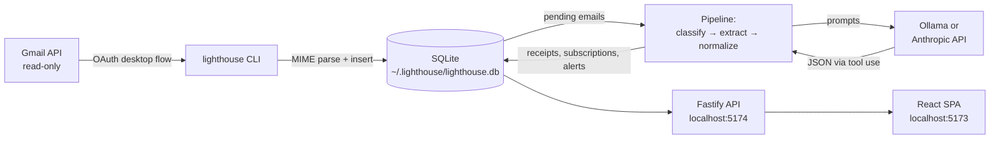

# Lighthouse

> Self-hosted Gmail receipt and subscription tracker. Privacy-first. AI-powered. MIT.

Lighthouse turns your Gmail inbox into a clean ledger of every purchase you've ever made and every subscription you're paying for — without giving any third party access to your bank, your credit card, or your inbox. It runs on your laptop. The only outbound calls are to Gmail (read-only) and to the LLM provider you choose (Anthropic by default; Ollama works too if you'd rather keep everything local).

```
┌──────────────────────────────────────────────────────────────┐
│  Lighthouse — local Gmail receipts                           │
│  Privacy-first. AI-powered. MIT.                             │
└──────────────────────────────────────────────────────────────┘

  Last 30 days        Active subs        Monthly subs        Open alerts
  $1,247.83           18                 $312.46             3
  ─────────────       ─────────────      ─────────────       ─────────────
  ▆▄▆█▇▆▅▇▆█▇▇        Netflix · Spotify   $3,749 / yr run     ⏳ 1 trial
                      Anthropic · Figma   rate                 ⚠ 1 price ↑
                      OpenAI · GitHub                          ↺ 1 dup chg
```

## Why

Most "subscription trackers" want one of two things:

1. **Your bank credentials**, via Plaid/MX/etc. They get a complete view of your finances. You get convenience. The privacy tradeoff is enormous — and fundamentally, the merchant-name data on a bank statement is *worse* than what's already in your inbox.
2. **OAuth into your Gmail and a copy of your data on their servers.** Same tradeoff with extra steps.

Lighthouse takes a third path: read-only Gmail access, an LLM extractor, a local SQLite database, and a dashboard you open at `localhost:5173`. Your data never leaves your computer. The LLM only sees the email contents you ship it — and you can swap to a local Ollama model and unplug the network entirely.

## What you get

Three things that are surprisingly hard to assemble today:

1. A clean ledger of every purchase across every merchant for the last 24 months.
2. A list of every active subscription with renewal date, amount, and a one-click "show me the email that proves this is recurring" view.
3. Free-trial-ending alerts and price-increase alerts on existing subscriptions.

## Quickstart

```bash
git clone https://github.com/your-handle/lighthouse.git
cd lighthouse
npm install

# 1. Create OAuth credentials at https://console.cloud.google.com/apis/credentials
#    (application type: Desktop app). Then:
cp .env.example .env
# Fill in GOOGLE_CLIENT_ID, GOOGLE_CLIENT_SECRET, ANTHROPIC_API_KEY.

# 2. Pick a passphrase, do the OAuth dance.
npm run setup

# 3. Crawl the last 24 months of mail and run the LLM extractor.
npm run sync

# 4. See the dashboard.
npm run serve   # then open http://localhost:5174
```

Or, if you'd rather try the dashboard before connecting anything:

```bash
npm run seed:demo   # 200 fake-but-plausible receipts and ~10 subscriptions
npm run serve
```

## Architecture



**Code map**

| Path | What lives here |
| --- | --- |
| `apps/cli/` | Commander CLI: `setup`, `sync`, `serve`, `status`, `alerts`, `export`, `import-takeout`. |
| `apps/web/` | The React + Tailwind dashboard SPA. |
| `packages/core/src/db/` | SQLite schema, migrations, query helpers, kv store. |
| `packages/core/src/crypto/vault.ts` | Argon2id key derivation, AES-256-GCM blob encryption. |
| `packages/core/src/gmail/` | OAuth desktop flow, MIME parser, incremental fetch loop. |
| `packages/core/src/llm/` | Anthropic + Ollama client, classifier, receipt + subscription extractors. |
| `packages/core/src/domain/` | Merchant rules, normalization, dedupe, alerts engine. |
| `packages/core/src/pipeline/` | Concurrency-bounded orchestrator that walks pending emails. |
| `packages/core/src/api/` | Fastify routes consumed by the SPA. |

The whole thing is deliberately small — about 6,000 lines of TypeScript including tests. You can read it in an afternoon.

## How extraction works

1. **Classify (Stage 1).** A cheap, single-shot Claude Haiku prompt sees only `(from, subject, snippet, first 500 chars of body)` and assigns one of nine buckets: `receipt`, `subscription_signup`, `subscription_renewal`, `subscription_cancellation`, `trial_started`, `trial_ending_soon`, `price_change`, `shipping_notification`, `not_relevant`. Result is cached in `classification_cache` keyed by `sha256(from + subject + snippet)`, so re-syncing is free.
2. **Extract (Stage 2 / 3).** Receipts and renewals get the receipt extractor; signup/trial/cancel/price emails get the subscription extractor. Both use Anthropic tool-use to coerce structured JSON, then validate the output against a Zod schema. If it doesn't validate, we don't write it.
3. **Normalize (Stage 4).** We dedupe merchants. "AMZN Mktp US*1A2B3", "Amazon.com", and "Amazon Marketplace" all collapse into one `Amazon` row. The first 70+ merchants are matched by hand-written rules (open a PR to add yours). Anything that doesn't match gets normalized by the LLM, with the result cached forever.
4. **Dedupe and score.** A pass groups receipts into subscription charges, computes the next renewal date from cycle math, and updates status (`active` / `cancelled` / `trial`).
5. **Alert.** We surface trial endings, price changes, new subscriptions, and apparent duplicate charges. Each alert is suppressed for 30 days after creation to avoid noise.

## Cost

Anthropic Claude Haiku 4.5 is cheap enough that running Lighthouse on a typical inbox is sub-$1.

| Inbox size | Tokens used (rough) | Approx cost on Haiku 4.5 |
| --- | --- | --- |
| 5,000 emails (1 yr light user) | ~3M in / ~0.4M out | ~$0.10 |
| 25,000 emails (2 yr typical) | ~15M in / ~2M out | ~$0.50 |
| 50,000 emails (2 yr heavy) | ~30M in / ~4M out | ~$1.00 |

Most of the cost is in classification, which we cache aggressively on every retry. Re-running a sync is essentially free.

## Privacy and safety

- **Read-only Gmail scope.** Lighthouse only requests `gmail.readonly`. It cannot send, modify, or delete mail.
- **Local-only by default.** The API binds to `127.0.0.1`. The frontend is served from the same origin. No CORS dance, no exposure to the rest of the network.
- **Encrypted token at rest.** Your Gmail refresh token is encrypted with a key derived from your passphrase via argon2id (`m=64MiB, t=3, p=1`) and stored in the SQLite kv table. Without the passphrase, the encrypted blob is useless.
- **Bearer token between SPA and API.** Generated on first setup, stored in `kv`. Read by the SPA via a same-host-only `/api/__token__` endpoint so other processes on the machine can't snoop.
- **No telemetry.** Lighthouse calls Gmail and your LLM, and nothing else.

## FAQ

**Is this safe?** It's as safe as the LLM provider you point at it. If you don't trust them, set `LLM_PROVIDER=ollama` and run a local model. Lighthouse never sends data anywhere except (a) the Gmail API, to read your mail, and (b) your chosen LLM. Outbound traffic is auditable from `~/.lighthouse/lighthouse.log`.

**What happens to my data?** It lives in `~/.lighthouse/lighthouse.db`. Delete the file and it's gone — no servers, no backups, no `we still have a copy`.

**Can I use Ollama instead of Anthropic?** Yes. Set `LLM_PROVIDER=ollama` and pick a model that supports JSON mode (Llama 3.1 8B works fine; Qwen 2.5 14B is better). Quality drops a bit on the harder categories (price changes, trial endings) but day-to-day extraction is solid.

**My receipts didn't extract.** Look in `~/.lighthouse/lighthouse.log` for the row id. Re-run with `LIGHTHOUSE_DEBUG=1` to see the model output. If you find a recurring failure mode, please open an issue with a redacted sample — we improve the prompts, not by adding regex band-aids.

**Will this work for non-USD inboxes?** Yes. Currencies are stored as ISO 4217 codes alongside cents-equivalents. The dashboard formats locally. EUR / GBP / JPY / INR are well-tested; less common currencies depend on the LLM's understanding.

**Do I need npm workspaces?** No. The `packages/*` and `apps/*` paths are linked via `workspaces` for tidy installs, but the build doesn't depend on monorepo tooling. You can `cd` into any package and run `tsc` directly.

## Contributing

The fastest way to help is to add a merchant rule. They live in `packages/core/src/domain/merchant_rules.ts` as a flat list:

```ts
{ canonical: 'klaviyo', display: 'Klaviyo', category: 'developer',
  domains: ['klaviyo.com'], aliasPatterns: [/^klaviyo\b/i] },
```

Domain matches win over alias matches. Category is used for grouping in the dashboard. Open a PR — there's no review queue.

Other ways to contribute:

- **Better extraction prompts.** Improvements that survive a small eval set are very welcome.
- **Currency formatters.** The current set is Intl-driven but could use better handling for some Asian currencies.
- **Dashboard polish.** Empty states, loading shimmers, mobile layout.
- **More tests.** The vault, parser, and dedupe pass have unit tests. The pipeline does not.

## Roadmap

These are things the codebase is shaped for but doesn't yet do:

1. **Custom alerts.** "Tell me when DoorDash is more than $50 in a week."
2. **Plaid as an opt-in second source.** Cross-reference inbox-derived charges with bank-derived charges to fill in cash payments and ATM withdrawals.
3. **Mobile app.** A Capacitor or Expo wrapper around the SPA. The API is already JSON-over-localhost; expose it over Tailscale or a simple SSH tunnel.
4. **Multi-account.** Read several inboxes (work + personal) into one DB with an `accounts` dimension.
5. **"Vendor of record" detection.** Surface the underlying service when something is billed via Stripe / Paddle / FastSpring.
6. **Tax-export workflow.** A "give my accountant only the business-categorized rows" CSV.
7. **Cancellation links.** Each subscription gets a deep link to the merchant's cancellation page (Apple, Adobe, etc.) when one exists.
8. **CLI-only mode.** Some users will never want the dashboard — make every workflow possible from the terminal.
9. **Per-merchant timeline view.** Click "Amazon" and see every order with line items, in calendar form.
10. **"Suspicious charge" investigator.** A small agent that, given a receipt, looks for the nearest signup/welcome email and explains where the recurring charge originated.

## Commands reference

```bash
npm run setup                     # interactive: passphrase + OAuth
npm run setup -- --rekey          # change vault passphrase
npm run sync                      # fetch + extract
npm run sync -- --no-fetch        # only run the LLM pipeline on stored emails
npm run serve                     # API + dashboard on localhost
npm run dev                       # API + Vite dev server, both with hot reload
npm run status                    # one-screen pipeline summary
npm run alerts                    # list open alerts in the terminal
npm run export -- -o ./out        # CSV receipts + JSON subscriptions
npm run import:gmail-takeout -- -f mail.mbox   # use Takeout instead of OAuth
npm run seed:demo                 # 200 fake receipts for the dashboard demo
npm run test                      # run the test suite
npm run lint                      # eslint
```

## Publishing your fork

If you want to publish a fork or your own copy:

```bash
# Easiest — uses GitHub CLI, creates a public repo and pushes:
./scripts/push-to-github.sh

# Or, if you've already created the repo on github.com:
./scripts/push-to-github.sh git@github.com:YOUR-USERNAME/lighthouse.git
```

The script handles `git init`, the first commit, and the remote setup. It's safe to re-run — it'll just push any new commits.

## License

[MIT](./LICENSE). Use it. Fork it. Build on it.

## Credits

- Receipt classification and extraction is powered by [Anthropic Claude](https://www.anthropic.com/).
- The dashboard's information density borrows from [Linear](https://linear.app/) and [Things](https://culturedcode.com/things/).
- The whole project owes a debt to people who keep insisting that personal data should live on personal computers.
