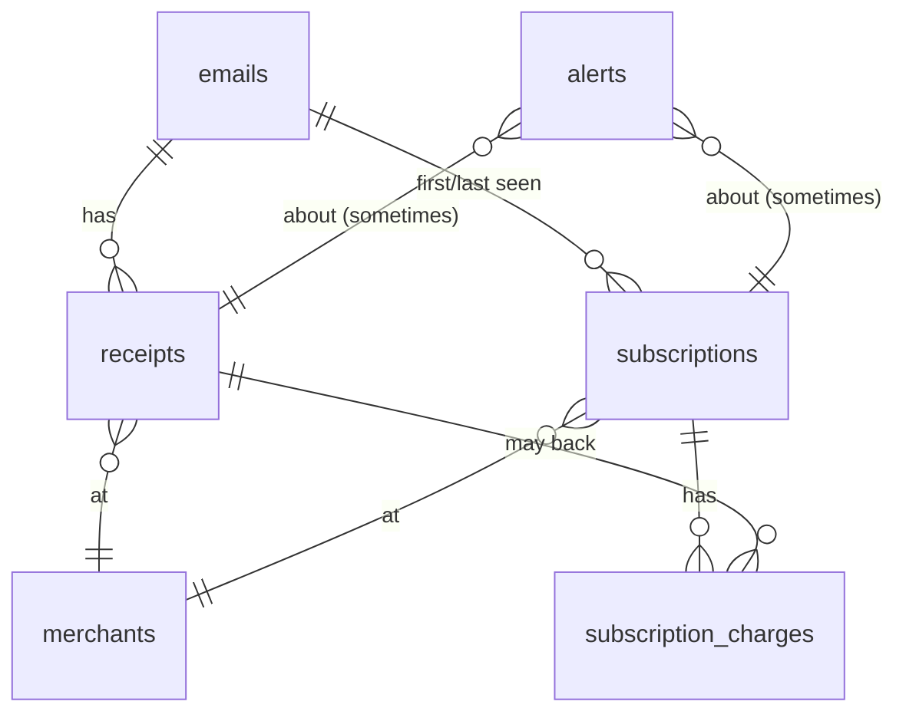

# Architecture

> A short tour of the moving parts. The whole thing is intentionally small — under ~6,000 lines of TypeScript including tests — so this doc is meant to be a map, not an epic.

## The shape of the system

```
        ┌────────────────────────────────────────────────────┐
        │                    User's machine                  │
        │                                                    │
   ┌──┐ │   ┌─────────────┐    ┌───────────────────────┐    │
   │  ├─┼──▶│ Gmail OAuth │───▶│ Refresh token (AES-GCM,│   │
   │G │ │   └─────────────┘    │ argon2id-derived key) │    │
   └──┘ │                       └───────────────────────┘    │
        │                                                    │
        │   ┌──────────┐    ┌─────────────┐    ┌─────────┐   │
   ┌──┐ │   │ Fetch    │───▶│ MIME parser │───▶│ emails  │   │
   │G │◀┼───┤ loop     │    └─────────────┘    │ (SQLite)│   │
   └──┘ │   └──────────┘                       └────┬────┘   │
        │                                          │         │
        │   ┌──────────────────────────────────────┴────┐    │
        │   │ Pipeline (concurrency=5):                 │    │
        │   │                                           │    │
   ┌──┐ │   │   classify → receipt|subscription extract │    │
   │A │◀┼───┤      ↓ Zod          ↓ Zod                │    │
   └──┘ │   │   merchant normalize (rules → LLM)        │    │
        │   │      ↓                                    │    │
        │   │   receipts, subscriptions, charges        │    │
        │   └────────────────┬──────────────────────────┘    │
        │                    │                               │
        │   ┌────────────────┴────────┐                      │
        │   │ dedupe + alerts pass    │                      │
        │   └────────────────┬────────┘                      │
        │                    ▼                               │
        │              ┌──────────┐    ┌─────────────────┐   │
        │              │ Fastify  │───▶│ React dashboard │   │
        │              │ (5174)   │    │ (5173 in dev,   │   │
        │              └──────────┘    │  static in prod)│   │
        │                              └─────────────────┘   │
        └────────────────────────────────────────────────────┘
```

`G` = Google APIs, `LLM` = whichever LLM provider you've configured. Both endpoints are over HTTPS. Everything else lives on disk.

## Key decisions

**SQLite, sync, single-writer.** `better-sqlite3` is synchronous on purpose. There is exactly one writer at any time (the CLI process or the API process). With WAL mode plus `synchronous = NORMAL` we get a tiny, fast, transactional store that fits in a single file. No worker threads, no async sqlite quirks.

**Money is integer cents.** Floats and money never appear together. The LLM extractor produces cents directly. Currency is an ISO 4217 code stored as text. The dashboard formats locally.

**ms-since-epoch timestamps.** SQLite has no native datetime. Integer ms sorts cleanly, compares directly with `Date.now()`, and round-trips through JS without timezone surprises.

**Vault is opt-in for the *user*, mandatory for the *system*.** The user picks the passphrase. The system always encrypts the Gmail refresh token — because if the SQLite file is exfiltrated, the encrypted blob is useless without the passphrase, and the passphrase is never persisted.

**Tool use, not regex.** The classifier and extractors all rely on the LLM returning structured JSON, which we Zod-validate before trusting. We deliberately do not write regex fallbacks for "edge cases" — when the LLM is wrong, we improve the prompt or accept the failure. This is a product design choice: an "AI extractor with rules sprinkled in" decays into a regex pile within six months.

**Caching is keyed by content hash.** Classifier results are cached on `sha256(from + subject + snippet)`. Merchant aliases are cached on `(raw, from_domain)`. Re-running a sync after a code change (but no inbox change) is essentially free.

**Concurrency 5.** Both Gmail fetch and LLM extraction use `p-limit(5)`. This is the rate-limit sweet spot for both APIs — high enough to stay under a few minutes for typical inboxes, low enough to never trigger 429.

## Data model



- `emails` — Gmail messages we've seen, with their `processed_status`. The lifecycle is `pending → classified → done|skipped|error`. Re-processing is just resetting status.
- `merchants` — The canonical list. The unique key is `canonical_name`.
- `receipts` — One row per purchase email, with `email_id` UNIQUE so re-processing the same message is idempotent.
- `subscriptions` — Has a unique key on `(merchant_id, billing_cycle, amount_cents, currency)` so the dedupe pass can naturally merge.
- `subscription_charges` — Each charge is unique by `receipt_id` (when not null), so attaching the same receipt twice is impossible.
- `alerts` — Stored with `subject_table` + `subject_id` so we can attach to anything; suppressed for 30 days after creation.
- `kv` — One-off key-value pairs (sync cursor, encrypted refresh token, vault salt + verifier, API token).
- `classification_cache` — Caches the cheap classifier so retries are free.
- `merchant_alias_cache` — Caches the LLM merchant normalization for `(raw, from_domain)` pairs.

## The pipeline, step by step

1. **Pop a batch of pending emails.** `getPendingEmails(200)` returns the most recent 200 emails with `processed_status = 'pending'`.
2. **For each email, dispatch under p-limit:**
   1. **Classify** — sha256 cache hit? Use it. Otherwise call the LLM with the metadata head and store the result.
   2. **If classification is `not_relevant` or `shipping_notification`:** mark `skipped`, return.
   3. **If classification is `receipt` or `subscription_renewal`:** call the receipt extractor with the full plaintext body (capped at 8KB). Insert a `receipts` row and, for renewals, also call the subscription extractor and upsert the `subscriptions` row + a `subscription_charges` link.
   4. **If classification is a pure subscription event:** call the subscription extractor and upsert the subscription with `status` derived from the `action` field.
   5. Mark `done` (or `error` with the message) on the email.
3. **Post-processing.**
   - **Dedupe.** Walk all subscriptions; attach any receipts within ±5% of the subscription amount; recompute next renewal date and status.
   - **Alerts.** Trial endings (≤ 7d), price increases (>5% vs prior 3 charges), new subscriptions (created since last sync), duplicate charges (same merchant within 24h, ≤5% apart). Each alert is suppressed for 30d post-creation.

## Extraction failure modes

When extraction fails, the row is marked `error` with the reason and the email is skipped on subsequent syncs. The CLI's `lighthouse status` command reports the count. To investigate:

```bash
LIGHTHOUSE_DEBUG=1 npm run sync -- --no-fetch
```

This will run the pipeline against already-stored emails and log the LLM's input/output for every classification and extraction.

Common failure modes and what we do about them:

| Failure | What's happening | What we do |
| --- | --- | --- |
| Tool call malformed | LLM returned text instead of using the tool | Retry up to 3× with backoff |
| Schema validation fails | Output is JSON but doesn't match Zod | Mark `error` with field details; logged for prompt improvement |
| Currency unknown | Non-USD/EUR/GBP without obvious signal | LLM emits `UNK`; dashboard formats with code only |
| Merchant unknown | Not in rules, LLM normalize fails | Insert raw name as canonical; alias is cached for next time |
| Multilingual receipts | Especially CJK | Frontier cloud LLMs handle this well; smaller local models vary |

## Performance

Rough numbers from a Mac M2 with a 24-month, 24,000-email inbox:

| Step | Time |
| --- | --- |
| `npm run sync` (Gmail fetch) | ~3 minutes |
| Pipeline (LLM extraction) | ~90 min (cloud LLM), ~3-4 hr (local Ollama 8B) |
| Dedupe + alerts pass | <1 second |
| API cold start | ~150 ms |
| Dashboard initial render | ~80 ms |

The pipeline is the long pole. It's network-bound; concurrency 5 is a polite default for most LLM provider rate limits. Bumping concurrency rarely speeds it up.

## What's intentionally not here

- **No background daemon.** Lighthouse runs only when you invoke the CLI. If you want to schedule sync, use cron or `launchd`.
- **No telemetry.** We don't track anything.
- **No upstream sync of any kind.** No GitHub Gist export, no Dropbox backup, no "share with my partner" mode. The data is yours; if you want a backup, copy `~/.lighthouse/lighthouse.db`.
- **No bank or card linking.** The whole point is that the inbox already has merchant-level granularity. Adding bank linking adds risk without adding much signal.
